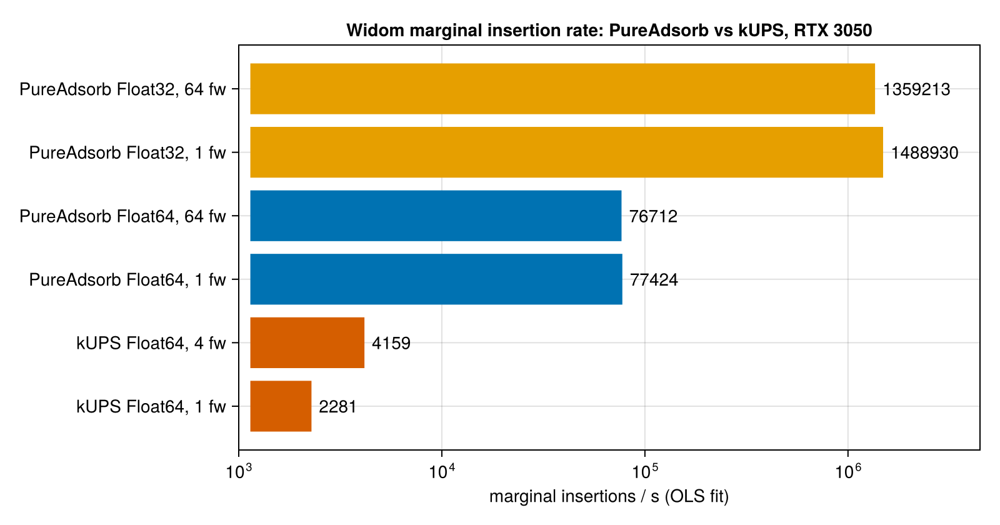

# Benchmarks

PureAdsorb against [kUPS](https://github.com/cusp-ai-oss/kups) on the same GPU. Numbers below
are computed from the committed JSON files in `bench/results/`; nothing here is re-measured for
this page.

## Widom insertion rate, RTX 3050 6 GB

RUBTAK 3×3×3 + CO2, LJ 12 Å / Ewald 12 Å cutoffs, Ewald precision 1e-6 — the same case, same
host CIF, force field and guest files (byte-identical to kUPS's own examples) on both codes.

| Code | Precision | Frameworks | Marginal rate (insertions/s) | Ratio to kUPS (1 fw) |
|---|---|---|---|---|
| kUPS | Float64 | 1 | 2,281 | 1.0× |
| kUPS | Float64 | 4 | 4,159 | 1.8× |
| PureAdsorb | Float64 | 1 | 77,424 | 33.9× |
| PureAdsorb | Float64 | 64 | 76,712 | 33.6× |
| PureAdsorb | Float32 | 1 | 1,488,930 | 652.7× |
| PureAdsorb | Float32 | 64 | 1,359,213 | 595.9× |

PureAdsorb's Float64 marginal rate is 33.9× kUPS's rate at 1 framework and 18.6× kUPS's best
rate (4 frameworks, the largest power-of-two batch that fits in 6 GB). kUPS forces
`jax_enable_x64` and has no Float32 mode for this workload, so the Float32 rows have no kUPS
counterpart; PureAdsorb's Float32 numbers are reported for reference only.



## Method

Both codes run on the same RTX 3050 (host `neuromancer`), but kUPS times its whole process
(interpreter startup, JIT compilation, and the insertions) while PureAdsorb's samples are
`Chairmarks` measurements of `widom(...)` warm, in-process — so `ninsert / t` is not comparable
between them directly. Instead, for each `nsys`, `t = intercept + ninsert / rate` is fit by
ordinary least squares over the median time at each `ninsert`, and the fitted `rate` is
compared; the intercept absorbs kUPS's per-process startup cost, which PureAdsorb's warm
in-process timing never pays. kUPS and PureAdsorb are timed in separate runs on this machine,
kUPS at commit `e183c9a` and PureAdsorb at commit `e903fac`.

## Fixed cost per process

| Code | Fixed cost per process (s) | What it includes |
|---|---|---|
| kUPS | ≈16.9–18.5 (regression intercept above) | interpreter startup, JIT compilation |
| PureAdsorb (CUDA) | 13.25 (median of 3 whole-process runs) | Julia startup, package load, kernel compilation, one warm sample |

PureAdsorb's fixed cost is `bench/results/pureadsorb_widom_processcost_neuromancer_f64_20260919.json`,
measured as whole-process wall time around a single-sample run, the same way kUPS's cost is a
whole-process time.

## Memory

kUPS batches insertions across all `nsys` systems into one compiled step, so its memory
requirement grows with `nsys`; on this 6 GB card it fails to build its batched state at
`nsys ∈ {8, 16, 32, 64}` with `RESOURCE_EXHAUSTED`. PureAdsorb runs `nsys = 64` on the same card
without difficulty. kUPS is Float64-only for this workload, so no Float32 memory comparison
exists.

PureAdsorb's own per-framework device footprint (RUBTAK 3×3×3 + CO2, default `cellwidth = 2`) is
143,436 B (Float64) and 89,552 B (Float32), from `bytes_per_system` in
`bench/results/pureadsorb_widom_scaling_galen_rocm_f64_run256_20260920_a4c86a7.json` and the
`f32` file alongside it.

## Reproducing

```bash
# kUPS timing (needs a kUPS checkout outside this repo, at commit e183c9a)
bench/run_headtohead.sh

# PureAdsorb, at the current commit
julia --project=bench/gpu -e 'using Pkg; Pkg.instantiate()'
PA_COMMIT=$(git rev-parse --short HEAD) PA_BACKEND=cuda PA_PRECISION=f64 julia --project=bench/gpu bench/widom_bench.jl
PA_COMMIT=$(git rev-parse --short HEAD) PA_BACKEND=cuda PA_PRECISION=f32 julia --project=bench/gpu bench/widom_bench.jl

# Regenerate the figure above from the committed JSON only
julia --project=bench bench/plot_headtohead.jl
PA_PLOT_OUT=docs/src/assets/widom_vs_kups.png julia --project=bench bench/plot_headtohead.jl
```

See `bench/results/README.md` for every other measurement recorded in this repository (CPU and
AMD Radeon AI PRO R9700 throughput, batch-size and run-length scaling, per-configuration
history), and `docs/src/validation.md` for the accuracy comparison against kUPS.
