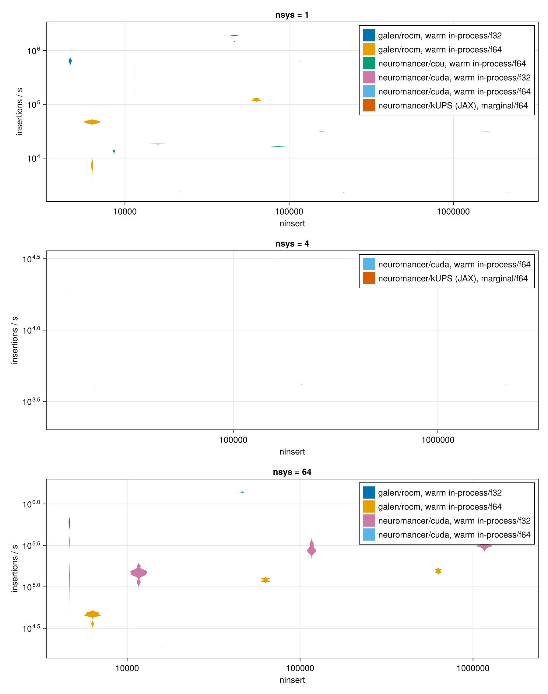
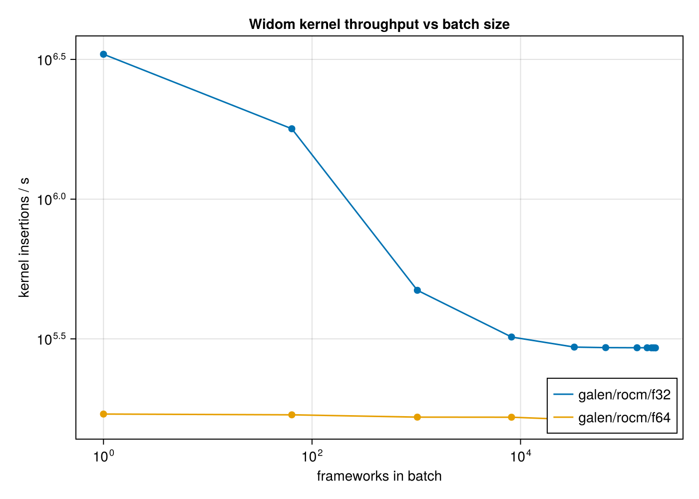

# Benchmarks

All numbers on this page are medians computed from the committed JSON files in
`bench/results/`; none are re-measured for this page. `BLAS.set_num_threads(1)` runs before
every timing in `bench/widom_bench.jl`.

## Machines

| Host | Hardware | Backend | Notes |
|---|---|---|---|
| neuromancer | CPU (16 threads) | KernelAbstractions CPU | CPU clock unpinned — indicative only |
| galen | AMD Radeon AI PRO R9700 (gfx1201, Navi48/RDNA4) | AMDGPU.jl (ROCm), AMDGPU 2.8.0 | clock-locked |
| neuromancer | NVIDIA GeForce RTX 3050 6 GB | CUDA.jl, driver 615.71.09 | Thunderbolt eGPU enclosure, CPU clock unpinned |

## PureAdsorb throughput

RUBTAK 3×3×3 + CO2, 12 Å cutoffs, Ewald precision 1e-6. `insertions/s = ninsert / median(times_s)`.

### CPU (Float64, neuromancer)

| nsys | ninsert | median (s) | insertions/s | samples |
|---|---|---|---|---|
| 1 | 10,000 | 0.7476 | 13,376 | 5 |
| 1 | 100,000 | 6.0817 | 16,443 | 2 |

Kernel-only (one launch of `widom_kernel!` + synchronize on a 2¹⁶-pose chunk):

| nsys | median (s) | insertions/s |
|---|---|---|
| 1 | 3.9427 | 16,622 |
| 64 | 4.2583 | 15,390 |

### AMD Radeon AI PRO R9700 (Float64, galen, ROCm)

| nsys | ninsert | median (s) | insertions/s | samples |
|---|---|---|---|---|
| 1 | 10,000 | 0.2051 | 48,746 | 10 |
| 1 | 100,000 | 0.7902 | 126,543 | 10 |
| 1 | 1,000,000 | 6.1742 | 161,964 | 5 |
| 64 | 10,000 | 0.2078 | 48,117 | 10 |
| 64 | 100,000 | 0.7978 | 125,347 | 10 |
| 64 | 1,000,000 | 6.2174 | 160,840 | 5 |

Kernel-only: nsys=1, 0.3926 s (166,933 ins/s); nsys=64, 0.3947 s (166,031 ins/s).

### AMD Radeon AI PRO R9700 (Float32, galen, ROCm)

| nsys | ninsert | median (s) | insertions/s | samples |
|---|---|---|---|---|
| 1 | 10,000 | 0.01562 | 640,007 | 10 |
| 1 | 100,000 | 0.05260 | 1,901,139 | 10 |
| 1 | 1,000,000 | 0.42068 | 2,377,105 | 10 |
| 64 | 10,000 | 0.01712 | 584,026 | 10 |
| 64 | 100,000 | 0.07350 | 1,360,574 | 10 |
| 64 | 1,000,000 | 0.63570 | 1,573,059 | 10 |

Kernel-only: nsys=1, 0.02221 s (2,951,251 ins/s); nsys=64, 0.03701 s (1,770,550 ins/s).

### NVIDIA RTX 3050 (Float64, neuromancer, CUDA)

| nsys | ninsert | median (s) | insertions/s | samples |
|---|---|---|---|---|
| 1 | 10,000 | 0.5335 | 18,743 | 10 |
| 1 | 100,000 | 3.1967 | 31,282 | 10 |
| 1 | 1,000,000 | 32.2178 | 31,039 | 1 |
| 64 | 10,000 | 0.5424 | 18,435 | 10 |
| 64 | 100,000 | 3.2482 | 30,786 | 10 |
| 64 | 1,000,000 | 33.1286 | 30,185 | 1 |

Kernel-only: nsys=1, 2.1309 s (30,756 ins/s); nsys=64, 2.1654 s (30,264 ins/s).

### NVIDIA RTX 3050 (Float32, neuromancer, CUDA)

| nsys | ninsert | median (s) | insertions/s | samples |
|---|---|---|---|---|
| 1 | 10,000 | 0.02483 | 402,714 | 10 |
| 1 | 100,000 | 0.15571 | 642,224 | 10 |
| 1 | 1,000,000 | 1.58056 | 632,686 | 10 |
| 64 | 10,000 | 0.06669 | 149,953 | 10 |
| 64 | 100,000 | 0.36208 | 276,182 | 10 |
| 64 | 1,000,000 | 3.18718 | 313,757 | 10 |

Kernel-only: nsys=1, 0.09976 s (656,932 ins/s); nsys=64, 0.18911 s (346,553 ins/s).

Consumer GeForce cards throttle double-precision throughput relative to a datacenter part:
the Float64/Float32 gap on the RTX 3050 (roughly 20× at nsys=1) is far larger than the
Float64-only R9700 numbers above would suggest by themselves.



## Throughput against batch size

`bench/widom_scaling.jl` measures kernel throughput — one `widom_kernel!` launch plus
synchronization, on a chunk of 262,144 insertions — against the number of frameworks (`nsys`)
tiled into one batch, on the R9700 (galen, ROCm). One framework's host and Ewald tables are
computed on the CPU and tiled onto the device; the batch stays on the device for the whole
sweep, and each batch size runs in its own process.

### Float64

| frameworks | batch size (GiB) | median kernel insertions/s |
|---|---|---|
| 1 | 0.0003 | 170,210 |
| 64 | 0.0197 | 169,137 |
| 1,024 | 0.316 | 165,956 |
| 8,192 | 2.525 | 165,841 |
| 32,768 | 10.10 | 162,576 |
| 65,536 | 20.20 | 161,946 |
| 81,920 | 25.25 | 161,540 |
| 90,112 | 27.78 | 161,492 |
| 94,208 | 29.04 | 161,301 |
| 98,304 | 30.30 | 161,019 |

### Float32

| frameworks | batch size (GiB) | median kernel insertions/s |
|---|---|---|
| 1 | 0.00016 | 3,299,882 |
| 64 | 0.0102 | 1,786,096 |
| 1,024 | 0.164 | 471,919 |
| 8,192 | 1.310 | 321,149 |
| 32,768 | 5.238 | 295,531 |
| 65,536 | 10.48 | 294,262 |
| 131,072 | 20.95 | 293,941 |
| 163,840 | 26.19 | 293,881 |
| 180,224 | 28.81 | 293,688 |
| 188,416 | 30.12 | 293,678 |
| 196,608 | 31.43 | 293,585 |

Float64 throughput changes by about 5% from 1 to 98,304 frameworks (170,210 to 161,019
insertions/s). Float32 falls from its one-framework value to a plateau reached by about
32,768 frameworks (295,531 insertions/s), essentially flat out to 196,608 frameworks
(293,585 insertions/s).

At the plateau, `bytes_per_system` — the per-framework device bytes the kernel reads — times
insertions/s gives an effective data rate: 330,984 B × 161,019 ins/s ≈ 53.3 GB/s (Float64, at
98,304 frameworks) and 171,648 B × 293,585 ins/s ≈ 50.4 GB/s (Float32, at 196,608 frameworks).
The two are close, consistent with the kernel being limited by memory traffic at large batch
sizes; this is an inference from the throughput numbers above, not something confirmed with a
profiler.

With one framework, every work-item reads the same host and Ewald tables. With many
frameworks, each work-item reads a different framework's tables, assigned round-robin
(`sys_of[i] = mod1(i, nsys)` in `random_poses!`, `src/widom.jl`). A screening run over distinct
frameworks is the many-framework case, so it operates at the large-batch figures above, not the
one-framework figures.

No batch size in this sweep failed to allocate; 98,304 frameworks (Float64, 30.3 GiB) and
196,608 frameworks (Float32, 31.4 GiB) are the largest sizes tested on this card, not a
measured failure point.



## kUPS head-to-head (RTX 3050, Float64)

`bench/run_headtohead.sh` alternates kUPS and PureAdsorb blocks for each `(nsys, ninsert)`
point on the same GPU, same cutoffs (LJ 12 Å, Ewald 12 Å, precision 1e-6), same force field,
host CIF and guest files (byte-identical to kUPS's own examples). kUPS times its whole process
(interpreter startup, JIT compilation, and the insertions); PureAdsorb's numbers are
`Chairmarks` samples of `widom(...)` warm, in-process. Comparing `ninsert / t` directly would
put a per-process cost against a per-call one on the same footing, so instead: for each `nsys`,
fit `t = intercept + ninsert / rate` by ordinary least squares over the median time at each
`ninsert`, and compare the fitted `rate`.

| Code | nsys | Fitted intercept (s) | Marginal rate (insertions/s) |
|---|---|---|---|
| kUPS | 1 | 16.87 | 2,281 |
| kUPS | 4 | 18.51 | 4,159 |
| PureAdsorb (warm in-process) | 1 | 0.092 | 31,128 |
| PureAdsorb (warm in-process) | 4 | 0.083 | 30,946 |

Ratio (PureAdsorb marginal rate / kUPS marginal rate): **13.6×** at nsys=1, **7.4×** at nsys=4
— kUPS batches insertions across systems more efficiently at nsys=4, while PureAdsorb was
already close to its per-call floor at nsys=1.

### Fixed cost per process

| Code | Fixed cost per process (s) | What it includes |
|---|---|---|
| kUPS | ≈16.9–18.5 (regression intercept above) | interpreter startup, JIT compilation |
| PureAdsorb (CUDA) | 13.25 (median of 3 whole-process runs: 13.44, 13.20, 13.25) | Julia startup, package load, kernel compilation, one warm sample |

PureAdsorb's `Chairmarks` loop is warm in-process by design and so excludes this cost from the
throughput tables above; it is measured separately as whole-process wall time around
`PA_GRID=1:10000 PA_REPS=1 julia --project=bench/gpu bench/widom_bench.jl`
(`bench/results/pureadsorb_widom_processcost_neuromancer_f64_20260919.json`).

## Memory

kUPS batches insertions across all `nsys` systems into one compiled step, so its GPU memory
requirement grows with `nsys`. On the 6 GB RTX 3050, kUPS fails to build its batched state at
`nsys ∈ {8, 16, 32, 64}`:

```
jax.errors.JaxRuntimeError: RESOURCE_EXHAUSTED: Out of memory while trying to allocate
51.26GiB.   # nsys=64
23.82GiB.   # nsys=32
10.08GiB.   # nsys=16
5.10GiB.    # nsys=8
```

PureAdsorb runs `nsys=64` on the same card without difficulty (see the throughput tables
above). kUPS is also Float64-only for this workload — `jax_enable_x64` is forced in
`kups.application.simulations.mcmc_widom` — so no Float32 comparison point exists for kUPS;
PureAdsorb's Float32 numbers are reported above for reference.

The kUPS figures above are on the 6 GB RTX 3050 (neuromancer); kUPS was not run on the R9700.
For comparison, in the same units, PureAdsorb's own per-framework device footprint
(`bytes_per_system` in `bench/widom_scaling.jl`) is 330,984 B ≈ 0.000308 GiB (Float64) and
171,648 B ≈ 0.000160 GiB (Float32) — measured on the 32 GB R9700 (galen), where the "Throughput
against batch size" section above runs batches up to 98,304 (Float64) and 196,608 (Float32)
frameworks.

## Caveats

- Single card per measurement; the RTX 3050 sits behind a Thunderbolt eGPU enclosure, and
  neuromancer's CPU clock is unpinned. Only galen (R9700) is clock-locked.
- Double-precision throughput on a GeForce card is throttled relative to a datacenter part;
  this affects both codes equally in the head-to-head, since both run Float64 there.
- One framework type (RUBTAK) and one guest (CO2) are measured throughout.
- `bench/run_headtohead.sh` sets the CPU governor to `performance` when writable; on
  neuromancer it was not (`powersave` throughout, recorded in each kUPS result's
  `meta.cpu_governor`).

## Reproducing

```bash
# CPU
julia --project=bench bench/widom_bench.jl

# GPU (separate environment — see bench/results/README.md for why)
julia --project=bench/gpu -e 'using Pkg; Pkg.instantiate()'
PA_BACKEND=cuda PA_PRECISION=f64 julia --project=bench/gpu bench/widom_bench.jl
PA_BACKEND=cuda PA_PRECISION=f32 julia --project=bench/gpu bench/widom_bench.jl
PA_BACKEND=rocm PA_PRECISION=f64 julia --project=bench/gpu bench/widom_bench.jl

# One (nsys, ninsert) grid point only, for a head-to-head run against kUPS
PA_BACKEND=cuda PA_GRID=4:1000000 PA_REPS=5 julia --project=bench/gpu bench/widom_bench.jl

# kUPS + PureAdsorb interleaved head-to-head (needs a kUPS checkout outside this repo)
bench/run_headtohead.sh

# Kernel throughput vs number of frameworks in a batch
PA_BACKEND=rocm PA_PRECISION=f64 julia --project=bench/gpu bench/widom_scaling.jl
PA_BACKEND=rocm PA_PRECISION=f32 julia --project=bench/gpu bench/widom_scaling.jl

# Near device capacity, one process per batch size: memory freed by a smaller batch is not
# returned to the device within the process, so the next large allocation would otherwise stall
PA_BACKEND=rocm PA_PRECISION=f64 PA_NSYS=81920 julia --project=bench/gpu bench/widom_scaling.jl
PA_BACKEND=rocm PA_PRECISION=f64 PA_NSYS=90112 julia --project=bench/gpu bench/widom_scaling.jl
PA_BACKEND=rocm PA_PRECISION=f64 PA_NSYS=98304 julia --project=bench/gpu bench/widom_scaling.jl

# Regenerate the plots above and the docs figures from the committed JSON only
julia --project=bench bench/plot_widom.jl
julia --project=bench bench/plot_scaling.jl
PA_PLOT_OUT=docs/src/assets/widom_throughput.png julia --project=bench bench/plot_widom.jl
PA_PLOT_OUT=docs/src/assets/widom_scaling.png julia --project=bench bench/plot_scaling.jl
```

`PA_BACKEND` selects `cpu` (default), `cuda` or `rocm`; `PA_PRECISION` selects `f64` (default)
or `f32`; `PA_GRID` restricts a `widom_bench.jl` sweep to one `nsys:ninsert` point and `PA_REPS`
sets its sample count; `PA_NSYS` restricts a `widom_scaling.jl` sweep to the given batch sizes
(space-separated, increasing). No plot is ever regenerated by re-running a benchmark —
`plot_widom.jl` and `plot_scaling.jl` only read `bench/results/*.json`.
