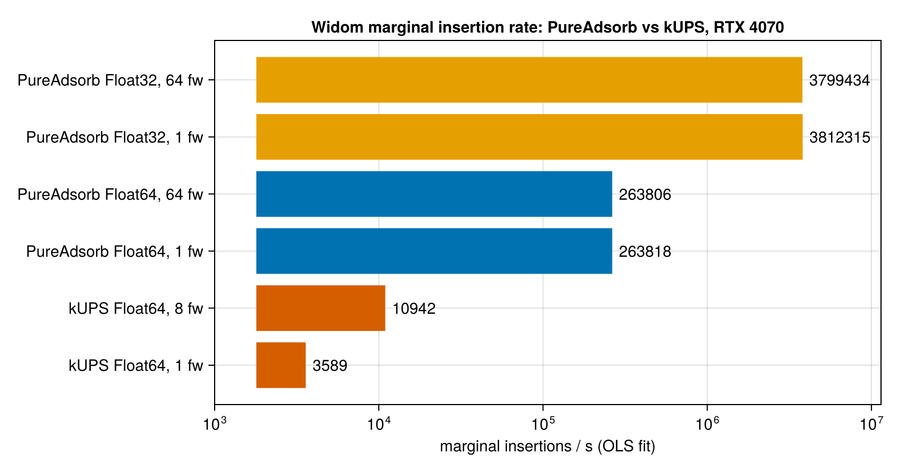
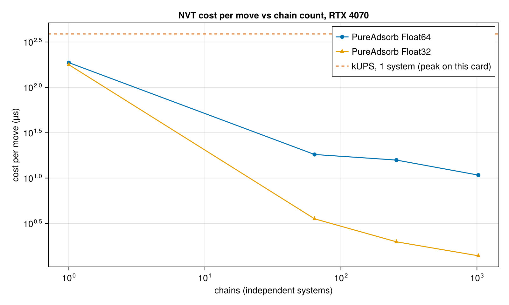
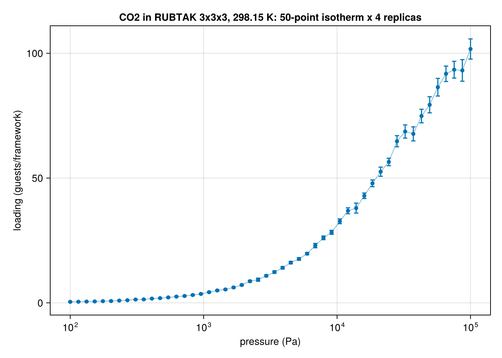

# Benchmarks

PureAdsorb against [kUPS](https://github.com/cusp-ai-oss/kups) on the same GPU, followed by
PureAdsorb on other hardware. Numbers below are computed from the committed JSON files in
`bench/results/`; nothing here is re-measured for this page.

## Widom insertion rate, RTX 4070 12 GB

RUBTAK 3×3×3 + CO2, LJ 12 Å / Ewald 12 Å cutoffs, Ewald precision 1e-6 — the same case, same
host CIF, force field and guest files (byte-identical to kUPS's own examples) on both codes, run
on the same card (host `neuromancer4070`, a USB4 eGPU enclosure).

| Code | Precision | Frameworks | Marginal rate (insertions/s) | Ratio to kUPS |
|---|---|---|---|---|
| kUPS | Float64 | 1 | 3,589 | 1.0× |
| kUPS | Float64 | 8 | 10,942 | — (kUPS's own best batch on this card) |
| PureAdsorb | Float64 | 1 | 263,818 | 73.5× |
| PureAdsorb | Float64 | 8 | 263,169 | 24.1× |
| PureAdsorb | Float64 | 64 | 263,806 | 24.1× (vs. kUPS's 8-fw row) |
| PureAdsorb | Float32 | 1 | 3,812,315 | 1,062.2× (reference; kUPS has no Float32 mode) |
| PureAdsorb | Float32 | 64 | 3,799,434 | 1,058.6× (reference) |

PureAdsorb's Float64 marginal rate is 73.5× kUPS's at one framework each — the literal,
same-batch-size comparison — and 24.1× kUPS's own best batch on this card (8 frameworks, its
memory ceiling; PureAdsorb's rate barely depends on the batch size, so its 8-fw and 64-fw rows
agree to within 0.3%). Both ratios come from the same two codes on the same card; the smaller,
fairer number is reported alongside the larger one, not in its place. kUPS forces
`jax_enable_x64` and has no Float32 mode for this workload, so the Float32 rows have no kUPS
counterpart; they are compared against kUPS's Float64 rate at 1 framework for reference only.



## Widom insertion rate, other hardware

The same case and source revision (`src/` is unchanged across the commits below, verified by
`git diff --stat <commit> b26cb8a -- src/`), on other cards. kUPS is not measured on any of
these, so the ratio column crosses machines and is not a like-for-like comparison of the two
codes.

| Code | Precision | Frameworks | Marginal rate (insertions/s) | Ratio to kUPS (RTX 4070, 1 fw) |
|---|---|---|---|---|
| PureAdsorb (R9700, ROCm) | Float64 | 1 | 270,794 | 75.4× |
| PureAdsorb (R9700, ROCm) | Float64 | 64 | 269,620 | 75.1× |
| PureAdsorb (R9700, ROCm) | Float32 | 1 | 2,700,433 | 752.4× |
| PureAdsorb (R9700, ROCm) | Float32 | 64 | 3,708,049 | 1,033.1× |
| PureAdsorb (Apple M6, Metal) | Float32 | 1 | 2,118,441 | 590.2× |
| PureAdsorb (Apple M6, Metal) | Float32 | 64 | 2,112,754 | 588.6× |
| PureAdsorb (Apple M6, CPU) | Float64 | 1 | 243,011 | 67.7× |

Apple GPUs have no double precision, so there is no Metal Float64 row; the CPU row on the same
machine is its Float64 reference instead. Comparing PureAdsorb against itself at 1 framework,
same code: the R9700 is 1.0× the RTX 4070 in Float64 and 0.7× in Float32; the Apple M6's Metal
backend is 0.6× the RTX 4070 in Float32.

## NVT (canonical Monte Carlo) throughput, RTX 4070 12 GB

RUBTAK 3×3×3 + 50 CO2, `mc_step!` (one Metropolis translation attempt per chain per kernel
launch, the workgroup-per-chain kernel run at its default `groupsize = 64` — the minimax choice
over the groupsize sweep in `pureadsorb_groupsizesweep_neuromancer4070_cuda_{f64,f32}_20260927_b6cc175.json`,
detailed in `bench/results/README.md`) against kUPS's own `examples/nvt_co2_pressure_test.yaml`
case (the same 50-CO2 system) on the same card.

| Precision | Chains | Cost per move (µs) | Ratio to kUPS (387.6 µs/move) |
|---|---|---|---|
| Float64 | 1     | 187.2 | 2.1× |
| Float64 | 64    | 18.2  | 21.3× |
| Float64 | 256   | 15.8  | 24.6× |
| Float64 | 1,024 | 10.8  | 36.0× |
| Float32 | 1     | 177.7 | 2.2× |
| Float32 | 64    | 3.55  | 109.0× |
| Float32 | 256   | 1.98  | 195.5× |
| Float32 | 1,024 | 1.39  | 278.7× |

PureAdsorb's numbers are `per_move_s` from `pureadsorb_mcstep_neuromancer4070_cuda_f64_20260927_5ff7620.json`
and the `f32` file alongside it. kUPS's reference rate is the same OLS fit as the Widom
comparison above (`t = intercept + nmoves/rate`) over its own single-system timing sweep
(`kups_nvt_timing_neuromancer4070_f64_20260927.json`: nmoves = 100,000 / 500,000 / 1,000,000;
fitted intercept 24.3 s, rate 2,580 moves/s, i.e. 387.6 µs/move, residuals under 1% at every
point). **Batching does not raise kUPS's rate: 387.6 µs/move is its peak on this card at any
chain count.** Its own chain-count sweep
(`kups_nvt_nscale_neuromancer4070_f64_20260927.json`) gives an aggregate throughput, once the
24.3 s startup is subtracted, of about 1,880 moves/s at its largest working batch (32
systems) — lower than the single-system rate — and 64 systems fails outright during state
construction with `RESOURCE_EXHAUSTED` trying to allocate 10.49 GiB. So the single-system
figure is kUPS's best case on this card at any batch size, and every ratio above is measured
against that ceiling, not against a smaller number a larger kUPS batch might have reached.



## Method

Both codes run on the same RTX 4070 (host `neuromancer4070`), but kUPS times its whole process
(interpreter startup, JIT compilation, and the insertions) while PureAdsorb's samples are
`Chairmarks` measurements of `widom(...)` warm, in-process — so `ninsert / t` is not comparable
between them directly. Instead, for each `nsys`, `t = intercept + ninsert / rate` is fit by
ordinary least squares over the median time at each `ninsert`, and the fitted `rate` is
compared; the intercept absorbs kUPS's per-process startup cost, which PureAdsorb's warm
in-process timing never pays. kUPS and PureAdsorb are timed in an interleaved run on this
machine (kUPS at commit `e183c9a`, PureAdsorb at commit `b26cb8a`), alternating a kUPS block
with a PureAdsorb block at each `(nsys, ninsert)` point so neither code is measured entirely
cold or entirely GPU-warmed relative to the other. The other-hardware numbers use the same fit
and the same grid, run separately rather than interleaved (PureAdsorb commits `e903fac` for the
R9700 and `53f8e40`/`97efb80` for the Apple M6).

The three-point grid (`ninsert` = 10^4, 10^5, 10^6) spans two decades, which gives the largest
point most of an unweighted fit's leverage: the fitted rate describes the large-run limit, not
a reliable small-run estimate, and the intercept is not a reliable estimate of small-run
overhead. Residuals of the fitted line against the median times, RTX 4070, nsys=1: PureAdsorb
Float64 is +34.7% at `ninsert=10^4`, -12.7% at `10^5`, +0.11% at `10^6`; PureAdsorb Float32 is
+21.6%, -8.1%, +0.08% at the same three points. kUPS's residuals stay under 2.5% everywhere
(largest magnitude 2.4%, at `ninsert=10^4`), since its own ~17-20 s fixed cost dominates the
small end and its per-insertion rate dominates the large end evenly.

### Transfer is not the bottleneck

The RTX 4070 sits behind a USB4 (not PCIe-native) eGPU enclosure (an ASMedia ASM2464-class
bridge negotiating 40 Gb/s), so its host-device link runs PCIe gen 4 at 4 lanes under sustained
load rather than the card's native 16-lane slot; measured host-device bandwidth at the transfer
sizes `widom`'s own per-chunk copies use is 1.3-1.6 GB/s. Against the kernel-only phase0+phase1
time at `nsys=1` (242.4 ms Float64, 12.45 ms Float32, both medians from the committed
`kernel_only_s` samples), the per-chunk transfer is **0.55% of kernel time at Float64 and 6.1%
at Float32 — not the bottleneck at either precision on this card.**

Scaling the `ninsert=10^6` end-to-end median down to one chunk-equivalent and subtracting the
kernel-only time gives a total non-kernel overhead per chunk of 3.2% (Float64) and 29.0%
(Float32) of end-to-end time. Only a small part of that is the measured transfer time above;
the remainder — host-side pose generation, survivor compaction, and Boltzmann-weight
accumulation — has not been decomposed further. That 29% at Float32 is unmeasured, not
attributed to any one of those candidates.

## Fixed cost per process

| Code | Fixed cost per process (s) | What it includes |
|---|---|---|
| kUPS | 17.2-20.5 (regression intercept above) | interpreter startup, JIT compilation |
| PureAdsorb (CUDA) | 16.18 (median of 3 whole-process runs) | Julia startup, package load, kernel compilation, one warm sample |

PureAdsorb's fixed cost is `bench/results/pureadsorb_widom_processcost_neuromancer4070_f64_20260926.json`,
measured as whole-process wall time around a single-sample run, the same way kUPS's cost is a
whole-process time. The two costs are close on this card: process startup is not a large
advantage for either code here.

## Memory

kUPS batches insertions across all `nsys` systems into one compiled step, so its memory
requirement grows with `nsys` and is set by the batched-state size, not the card. On this 12 GB
card it builds `nsys ∈ {1, 2, 4, 8}` but fails at `nsys=16` with `RESOURCE_EXHAUSTED` trying to
allocate 10.08 GiB — the identical allocation size that failed on a 6 GB card at the same
`nsys=16`; doubling the card's memory (6 GB to 12 GB) bought exactly one more doubling of usable
batch size (4 to 8), not an unbounded increase, because the batched-state allocation itself
doubles with `nsys`. JAX also reserves most of the GPU's memory at process start by default,
independent of this allocation. PureAdsorb runs `nsys = 64` on the same card without difficulty.

PureAdsorb's own per-framework device footprint (RUBTAK 3×3×3 + CO2, default `cellwidth = 2`) is
143,436 B (Float64) and 89,552 B (Float32), from `bytes` in
`bench/results/pureadsorb_widom_scaling_galen_rocm_f64_run256_20260920_a4c86a7.json` and the
`f32` file alongside it.

## GCMC (grand canonical) exchange moves, RTX 4070 12 GB

`mc_insert!`/`mc_delete!` are the μVT exchange moves task 5's driver mixes 50/50 into a GCMC
chain (`bench/results/README.md`'s "μVT exchange moves: workgroup fan-out" section has the
kernel-level detail). kUPS runs its own exchange moves through the same `mcmc_rigid.py` chain
its NVT case uses, but has no dedicated single-move GCMC timing sweep of its own — only the
memory-ceiling sweep below and one accuracy validation run (`docs/src/validation.md`'s C4). This
comparison therefore reuses kUPS's own NVT peak rate, 387.6 µs/move (the NVT section above), as
the best available kUPS reference for the cost of one Metropolis attempt on this card: kUPS's
batching never beats its own single-system rate, so that one number is its ceiling for any move
type on this card, not only translation.

**One number here needs a caveat before the table.** `bench/gpu/exchange_bench.jl`'s own
committed numbers (`pureadsorb_exchange_percall_*.json`) are not cited below: that script issues
`mc_exchange!` from top-level script variables and, in its warm-up loop, reseeds `Xoshiro(1)`
fresh on every call — the same fixed seed every time — so its 0.5 s wall-clock warm-up window
only ever compiles whichever one of `mc_insert!`/`mc_delete!` that fixed seed's coin flip picks.
`bench/gpu/units_overhead_bench.jl`'s own header independently documents both failure modes (a
closure over non-`const` top-level globals, and this exact missing-branch-compile trap) and
measures the second one inflating a genuinely ~167 µs/call cost to a uniform 1.9-3.2 ms/call
across every sample. `exchange_bench.jl`'s numbers (12.8-18.7 ms/call, an order of magnitude
above the table below) are consistent with carrying the same artifact. Rather than re-measure
that script, the table below uses `bench/gpu/exchange_workgroup_bench.jl` instead, which builds
its entire timed closure from one function's (`run_one`) local, typed arguments and explicitly
pre-compiles both `mc_insert!` and `mc_delete!` before any warm-up call — the pattern
`units_overhead_bench.jl` converged on. Its nsys=1/64/256 numbers are already committed
(`pureadsorb_exchange_workgroup_*_after_*.json`); nsys=8 (kUPS's own GCMC ceiling, below) was
added here with the same script, same card, same day, RUBTAK 3×3×3 + CO2, 10 initial
guests/chain, capacity 40, fugacity 2e4 Pa:

| Precision | Chains | Insert (µs/move) | Delete (µs/move) | Mean exchange (µs/move) | Ratio to kUPS (387.6 µs/move) |
|---|---|---|---|---|---|
| Float64 | 1   | 201.4 | 139.5 | 170.5 | 2.3× |
| Float64 | 8   | 38.4  | 24.2  | 31.3  | 12.4× |
| Float64 | 64  | 12.8  | 7.6   | 10.2  | 38.0× |
| Float64 | 256 | 9.9   | 6.3   | 8.1   | 47.9× |
| Float32 | 1   | 155.8 | 103.4 | 129.6 | 3.0× |
| Float32 | 8   | 25.3  | 16.8  | 21.1  | 18.4× |
| Float32 | 64  | 3.2   | 1.9   | 2.6   | 150.9× |
| Float32 | 256 | 1.2   | 0.7   | 0.9   | 409.6× |

"Chains" above is `nsys`; the µs/move columns are each row's own `mc_insert!`/`mc_delete!`
per-call cost divided by `nsys`, since one call advances every chain in the batch by one move.
The nsys=1/8 rows are `pureadsorb_exchange_workgroup_neuromancer4070_cuda_{f64,f32}_task10_20260927_9917bf5.json`
(this run); nsys=64/256 are the already-committed
`pureadsorb_exchange_workgroup_neuromancer_cuda_{f64,f32}_after_20260927_f4a0503.json` — a
different commit and a slightly different `PA_HOST` string (the earlier run left `PA_HOST`
unset), so the nsys=1 mean exchange cost above (170.5 µs Float64, 129.6 µs Float32) differs from
that file's own nsys=1 mean (161.4 µs Float64, 132.2 µs Float32) by a few percent — run-to-run
noise of the same scale `units_overhead_bench.jl`'s own repeated-measurement note already
documents for this kernel, not a change in `mc_insert!`/`mc_delete!` themselves
(`bench/results/README.md`'s task 10 section has the commit-history detail).

**The exchange advantage over kUPS is real but much smaller than NVT's, and the batched rows
above must not be read as contradicting that.** At one chain — the only batch size directly
comparable to kUPS's own single-system rate without any batching helping either code — PureAdsorb
is 2.3-3.0× kUPS, not the 36× (Float64, 1,024 chains) the NVT table above reaches. The reason is
structural, not incidental: an NVT translation reuses `host_energy`'s cached guest-host term and
only needs `ΔS(k)` for the one moved guest, while an insertion has no prior pose to cache against
and must sum a brand-new guest's interaction against every host atom (`insertion_energy`'s full
scan) plus the full k-vector reciprocal sum from scratch — `docs/src/theory.md`'s "Guest–guest
energy" and "The running structure factor" sections describe the cache NVT moves get and
insertion cannot. The batched rows (38-48× at Float64, up to 410× at Float32) show PureAdsorb's
own batching benefit, which is real, but kUPS's GCMC ceiling of 8 chains (below) means no
same-batch-size comparison beyond nsys=8 is possible against kUPS at all — those larger-batch
rows are PureAdsorb against itself, included for context, not part of the head-to-head ratio.

## A GCMC isotherm: CO2 in RUBTAK 3x3x3

`run_isotherm!` (`src/isotherm.jl`) builds one batch of 50 log-spaced pressure points (100 Pa to
1e5 Pa) times 4 replicas — 200 systems, one shared framework — and runs 700 cycles (200 warmup +
500 production) as a single GCMC call. Build time is 0.28 s (framework deduplication keeps it
close to one framework's own setup cost regardless of `nsys`); the run itself takes 151 s.



Loading rises monotonically at every point, from 0.40 guests at 100 Pa to 101.7 guests at 1e5 Pa:
Henry-linear (`loading/pressure` flat at 0.0037-0.0040 guests/Pa) over the bottom six points, and
clearly sub-linear (falling to 0.0010-0.0016 guests/Pa) over the top six — a Type-I saturation
curve. The batch-wide capacity (200) is never approached: the worst-case occupancy across all 50
pressures is 136/200 (68%), at the highest pressure. Full detail, including the near-plateau
between 3.7e4 and 8.7e4 Pa (inside statistical error, not a real non-monotonicity), is in
`bench/results/README.md`'s "A real isotherm" section; the source data is
`bench/results/pureadsorb_isotherm_co2_rubtak_neuromancer_cuda_f64_20260927_873c9ed.json`.

## GCMC memory

kUPS batches a GCMC chain's state across all `nsys` systems into one compiled step, same as its
NVT/Widom cases above, but a GCMC batch additionally reserves `max_num_adsorbates` buffer slots
per system (auto-estimated from the ideal-gas reservoir occupancy), so its memory ceiling is
worse than either of those: `bench/run_kups_gcmc.sh nscale` runs `nsys ∈ {1, 2, 4, 8}`
successfully on this 12 GiB card and fails at `nsys=16` requesting 13.18 GiB — **8 systems**,
against 32 for kUPS's own NVT case and no failure at all for PureAdsorb's own Widom case on this
card (both established above). Treating that 13.18 GiB request as the whole 16-system batch
(consistent with "the batched-state allocation itself doubles with `nsys`", established in the
Widom "Memory" section above) gives kUPS's own per-system footprint as roughly
13.18 GiB / 16 ≈ 885 MB.

PureAdsorb's own per-system device footprint is a `SystemState`'s own arrays — computed
analytically from field lengths and element sizes, the same pattern the Widom "Memory" section
above uses for `FrameworkBatch`'s per-framework footprint — at the isotherm run's own capacity
(200) and RUBTAK 3×3×3's full k-vector table (`fullk = true`, required once any guest is
present, nk = 4587):

| Precision | Bytes/system | kUPS bytes/system (estimate) | Ratio |
|---|---|---|---|
| Float64 | 122,952 (120.1 KiB) | ≈885 MB | ≈7,200× less |
| Float32 | 61,500 (60.1 KiB) | ≈885 MB (kUPS forces float64) | ≈14,400× less |

`Sk` and `sk_abs_accum` — sized by the full k-vector table, not `capacity` — are most of this:
4587 k-vectors × (`Complex{F}` + `F`) is 110,088 B of the 122,952 B Float64 total. This is why
PureAdsorb runs the whole 200-system isotherm above without difficulty on the same card where
kUPS's own GCMC case fails at 16: `bench/gpu/gcmc_memory_bench.jl`,
`bench/results/pureadsorb_gcmc_memory_neuromancer_20260927_9917bf5.json`.

## Reproducing

```bash
# kUPS timing (needs a kUPS checkout outside this repo, at commit e183c9a)
PA_HOST=neuromancer4070 bench/run_headtohead.sh

# PureAdsorb, at the current commit
julia --project=bench/gpu -e 'using Pkg; Pkg.instantiate()'
PA_HOST=neuromancer4070 PA_COMMIT=$(git rev-parse --short HEAD) PA_BACKEND=cuda PA_PRECISION=f64 julia --project=bench/gpu bench/widom_bench.jl
PA_HOST=neuromancer4070 PA_COMMIT=$(git rev-parse --short HEAD) PA_BACKEND=cuda PA_PRECISION=f32 julia --project=bench/gpu bench/widom_bench.jl

# R9700, on galen: same script, ROCm backend
PA_COMMIT=$(git rev-parse --short HEAD) PA_BACKEND=rocm PA_PRECISION=f64 julia --project=bench/gpu bench/widom_bench.jl
PA_COMMIT=$(git rev-parse --short HEAD) PA_BACKEND=rocm PA_PRECISION=f32 julia --project=bench/gpu bench/widom_bench.jl

# Apple M6, on brutus: CPU reference, then the Metal backend (Float32 only)
julia --project=bench/metal -e 'using Pkg; Pkg.instantiate()'
julia --project=bench/metal bench/widom_bench.jl
PA_BACKEND=metal PA_PRECISION=f32 julia --project=bench/metal bench/widom_bench.jl

# Regenerate the figure above from the committed JSON only
julia --project=bench bench/plot_headtohead.jl
PA_PLOT_OUT=docs/src/assets/widom_vs_kups.png julia --project=bench bench/plot_headtohead.jl

# NVT (mc_step!) chain-count sweep, PureAdsorb
PA_HOST=neuromancer4070 PA_BACKEND=cuda PA_PRECISION=f64 julia --project=bench/gpu bench/mc_step_bench.jl
PA_HOST=neuromancer4070 PA_BACKEND=cuda PA_PRECISION=f32 julia --project=bench/gpu bench/mc_step_bench.jl

# NVT reference, kUPS (needs a kUPS checkout outside this repo, at commit e183c9a)
KUPS=~/src/kups PA_HOST=neuromancer4070 bench/run_kups_nvt.sh timing
KUPS=~/src/kups PA_HOST=neuromancer4070 bench/run_kups_nvt.sh nscale

# Regenerate the NVT figure above from the committed JSON only
julia --project=bench bench/plot_nvt_vs_kups.jl
PA_PLOT_OUT=docs/src/assets/nvt_vs_kups.png julia --project=bench bench/plot_nvt_vs_kups.jl

# GCMC exchange move cost, PureAdsorb (add PA_NSYS_LIST="1,8" to reproduce the kUPS-comparable rows)
PA_HOST=neuromancer4070 PA_BACKEND=cuda PA_PRECISION=f64 PA_NSYS_LIST="1,8" julia --project=bench/gpu bench/gpu/exchange_workgroup_bench.jl
PA_HOST=neuromancer4070 PA_BACKEND=cuda PA_PRECISION=f32 PA_NSYS_LIST="1,8" julia --project=bench/gpu bench/gpu/exchange_workgroup_bench.jl

# kUPS GCMC memory ceiling (needs a kUPS checkout outside this repo, at commit e183c9a)
KUPS=~/src/kups PA_HOST=neuromancer4070 bench/run_kups_gcmc.sh nscale 200 64

# PureAdsorb's own per-system GCMC memory footprint (no GPU needed)
julia --project=bench/gpu bench/gpu/gcmc_memory_bench.jl

# The isotherm (Milestone C task 6); regenerating the run itself needs the RTX 4070 and ~3 minutes
PA_HOST=neuromancer4070 PA_BACKEND=cuda PA_PRECISION=f64 julia --project=bench/gpu bench/gpu/isotherm_bench.jl

# Regenerate the isotherm figure above from the committed JSON only
julia --project=bench bench/plot_isotherm.jl
PA_PLOT_OUT=docs/src/assets/isotherm_co2_rubtak.png julia --project=bench bench/plot_isotherm.jl
```

See `bench/results/README.md` for every other measurement recorded in this repository (CPU and
AMD Radeon AI PRO R9700 throughput, batch-size and run-length scaling, per-configuration
history, and the RTX 3050's own head-to-head numbers), and `docs/src/validation.md` for the
accuracy comparison against kUPS.
